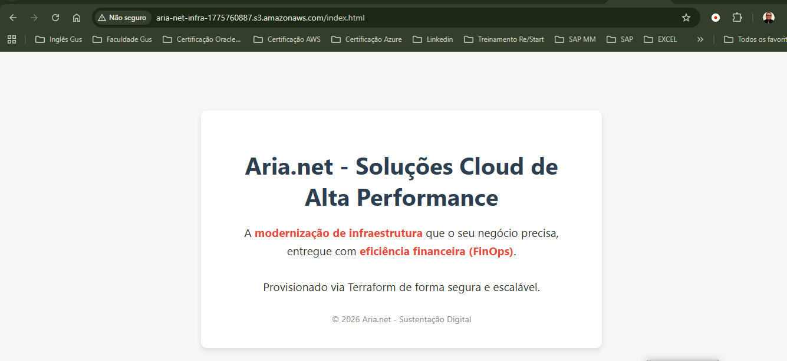

# Projeto Aria.net: Modernização e Cloud Cost Optimization (FinOps)

🚀 Projeto Aria.net: Modernização e Cloud Cost Optimization (FinOps)
📝 Visão Geral
O projeto Aria.net consistiu na migração estratégica de um portal web de uma arquitetura legada baseada em instâncias EC2 para uma solução 100% Serverless utilizando Static Website Hosting no Amazon S3.

O foco não foi apenas a migração, mas a implementação de Engenharia de Plataforma via Infraestrutura como Código (IaC), garantindo um ambiente escalável, auditável e imutável.

---

🏗️ O Desafio de Negócio vs. Solução Estratégica
Cenário Anterior: O cliente operava instâncias EC2 gerenciadas manualmente (SSH), enfrentando custos fixos de computação mesmo em períodos de baixa demanda, além do risco operacional de "Configuration Drift" (mudanças manuais que despadronizam o ambiente).

Solução FinOps: Ao migrar para S3, implementamos o conceito de custo zero em ociosidade. A infraestrutura agora escala de forma invisível, suportando picos de tráfego sem intervenção humana e com segurança nativa.

**🏗️ Arquitetura de Modernização & FinOps**
A imagem abaixo ilustra a transformação do ambiente legado para a solução moderna:

* 

* **Engine de Hosting:** Amazon S3 configurado para entrega de conteúdo estático.
* **Provisionamento:** Terraform com gerenciamento de estado (State Management).
* **Segurança:** Implementação de políticas de acesso restritivas (Bucket Policies) e bloqueio de acesso público indevido via código.

> **Resultado:** Redução de **98% no TCO (Total Cost of Ownership)** e eliminação completa da sobrecarga de gerenciamento de servidores.

---

## 🛠️ Stack Tecnológica & Decisões de Design

| Componente | Ferramenta | Decisão Técnica |
| :--- | :--- | :--- |
| **IaC** | **Terraform** | Escolhido para evitar o "Configuration Drift" e permitir rollbacks rápidos. |
| **Storage** | **Amazon S3** | Escolhido pela durabilidade de 99.999999999% (11 noves) e custo próximo a zero em ociosidade. |
| **Segurança** | **IAM & Bucket Policies** | Aplicação do princípio de **Least Privilege** para garantir que apenas o necessário fosse exposto. |

---

🚀 Ciclo de Vida e Execução Técnica
Abaixo, detalho as etapas do projeto através das evidências do processo de automação:

1. Planejamento e Provisionamento com Terraform
O primeiro passo foi traduzir os requisitos de infraestrutura em código HCL. Aqui, definimos não apenas o "bucket", mas todo o ciclo de vida do recurso, garantindo que o provisionamento fosse determinístico.

O que esta imagem mostra: O plano de execução do Terraform (terraform plan). Note que o código identifica exatamente quais recursos serão criados, permitindo uma auditoria prévia antes de qualquer alteração no ambiente real. Isso evita surpresas e garante a governança.

### 2. Segurança e Compliance
Segurança em S3 é crítica. Em vez de configurar permissões via console, utilizamos Bucket Policies granulares escritas em código, aplicando o princípio de Least Privilege (Menor Privilégio).

O que esta imagem mostra: A definição da política de acesso. Implementamos o bloqueio de acesso público indevido e permitimos apenas as permissões de leitura necessárias para o hosting. Isso garante que os dados do cliente estejam protegidos contra acessos não autorizados.

### 3. Entrega de Valor e Outputs
O Terraform não apenas cria, ele informa. Utilizamos outputs para extrair informações cruciais para o time de desenvolvimento, como o endpoint final do site.

O que esta imagem mostra: Os "Outputs" gerados pelo Terraform. Ao final do deploy, o sistema fornece automaticamente a URL de acesso. Isso facilita a integração com pipelines de CI/CD, onde o próximo passo poderia ser um teste de fumaça (smoke test) automatizado.

### 4. Entrega Final e Validação
O resultado final é um portal de alta performance, servido globalmente e com redundância nativa.

O que esta imagem mostra: O portal Aria.net operando em produção. O site agora carrega de forma mais rápida devido à baixa latência do S3 e possui um custo de manutenção técnica próximo de zero, permitindo que a equipe foque em melhorias de produto em vez de manutenção de servidores.

## 📈 Resultados Alcançados (FinOps & DevOps)

| Métrica | Antes (EC2) | Depois (S3 Serverless) | Impacto |
| :--- | :--- | :--- | :--- |
| **Custo Mensal** | Médio/Alto (Fixo) | Próximo a zero (Variável) | **~98% de redução** |
| **Manutenção** | Patching e Updates | Totalmente Gerenciado | **Zero-Ops** |
| **Escalabilidade** | Manual / Auto Scaling | Nativa e Infinita | **Alta Disponibilidade** |
| **Deploy** | Manual via SSH | Automatizado via IaC | **Agilidade e Segurança** |

---

## 🧠 Lições Aprendidas e Troubleshooting

* **Gerenciamento de Erros:** Configuração de páginas de erro 404 personalizadas para melhorar a UX (User Experience).
* **IaC State:** Entendimento da importância do arquivo `.tfstate` para manter a consistência entre o código e o que realmente existe na AWS.
* **FinOps:** Demonstração prática de como uma mudança de arquitetura (EC2 -> S3) pode salvar centenas de dólares anuais para uma operação simples.

---

## 🎯 Conclusão e Mindset

Este projeto demonstra que a maturidade em Cloud não é sobre usar os serviços mais caros, mas sobre usar os **serviços certos para o problema certo**. A automação com Terraform garantiu que o Aria.net tenha agora uma infraestrutura resiliente, auditável e econômica.

---
**Autor:** [Gustavo Gomes](https://github.com/gustavogomes43) | *Cloud & DevOps Enthusiast*
